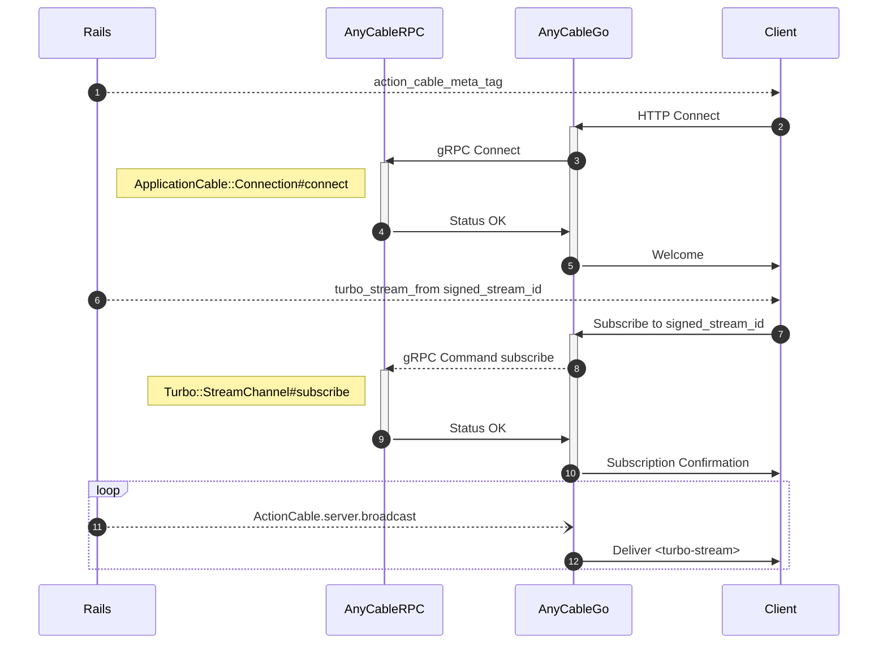
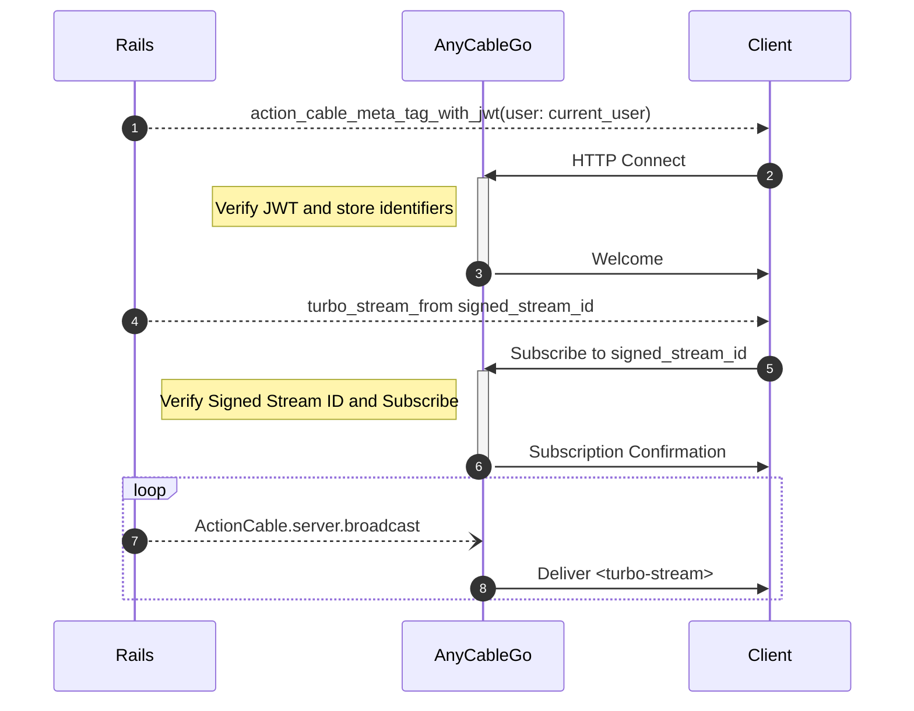

# Using AnyCable with Hotwire

AnyCable be used as a [Turbo Streams][] backend for **any application**, not only Ruby or Rails.

## Rails applications

Since [turbo-rails][] uses Action Cable under the hood, no additional configuration is required to use AnyCable with Hotwired Rails applications. See the [getting started guide](../rails/getting_started.md) for instructions.

However, you can squeeze even more _power_ from AnyCable for Hotwire apps by going the **RPC-less way**.

### RPC-less setup for Rails

> 🎥 Check out this AnyCasts screencast—it's a video guide on setting up Hotwire with AnyCable in the RPC-less way: [Exploring Rails 7, Hotwire and AnyCable speedy streams](https://anycable.io/blog/anycasts-rails-7-hotwire-and-anycable/).

The following steps are required to go the RPC-less way with a Rails application:

- Install and configure the [anycable-rails-jwt][] gem:

  ```yml
  # anycable.yml
  production:
    jwt_id_key: "some-secret-key"
  ```

- Configure the Turbo Streams verifier key:

  ```ruby
  # config/environments/production.rb
  config.turbo.signed_stream_verifier_key = "s3cЯeT"
  ```

- Enable JWT identification and signed streams in AnyCable-Go:

  ```sh
  ANYCABLE_JWT_ID_KEY=some-secret-key \
  ANYCABLE_TURBO_RAILS_KEY=s3cЯeT \
  anycable-go

  # or via cli args
  anycable-go --jwt_id_key=some-secret-key --turbo_rails_key=s3cЯeT
  ```

That's it! Now you Turbo Stream connections are served solely by AnyCable-Go.

## Other frameworks and languages

Hotwire is not limited to Ruby on Rails. You can use Turbo with any backend. Live updates via Turbo Streams, however, require a _connection_ to receive the updates. This is where AnyCable comes into play.

You can use AnyCable-Go as a WebSocket server for Turbo Streams if you enable [Turbo signed streams](../anycable-go/signed_streams.md) and [JWT authentication](../anycable-go/jwt_identification.md) features.

The complete setup looks as follows:

- Implement JWT token generation.

  Here is an example Ruby code:

  ```ruby
  # Connection identifiers can be used to distinguish users
  identifiers = {user_id: 42}
  # Expiration is optional
  payload = {ext: identifiers.to_json, exp: Time.now.to_i + 300}
  JWT.encode payload, ENCRYPTION_KEY, "HS256"
  ```

  The Python version would look like this:

  ```python
  import json
  import jwt
  import time

  identifiers = {'user_id': 42}
  payload = {'ext': json.dumps(identifiers), 'exp': int(time.time()) + 300}
  jwt.encode(payload, ENCRYPTION_KEY, algorithm='HS256')
  ```

  The PHP version is as follows:

  ```php
  use Firebase\JWT\JWT;

  $identifiers = ['user_id' => 42];
  $payload = ['ext' => json_encode($identifiers), 'exp' => time() + 300];
  $jwt = JWT::encode($payload, $ENCRYPTION_KEY, 'HS256');
  ```

- Implement stream signing\*:

  Here is the Ruby code to sign streams the same way as Rails does:

  ```ruby
  encoded = ::Base64.strict_encode64(JSON.dump(stream_name))
  digest = OpenSSL::HMAC.hexdigest("SHA256", SECRET_KEY, encoded)
  signed_stream_name = "#{encoded}--#{digest}"
  ```

  The Python version looks as follows:

  ```python
  import base64
  import json
  import hmac
  import hashlib

  encoded = base64.b64encode(json.dumps(stream_name).encode('utf-8')).decode('utf-8')
  digest = hmac.new(SECRET_KEY.encode('utf-8'), encoded.encode('utf-8'), hashlib.sha256).hexdigest()
  signed_stream_name = f"{encoded}--{digest}"
  ```

  The PHP version is as follows:

  ```php
  $encoded = base64_encode(json_encode($stream_name));
  $digest = hash_hmac('sha256', $encoded, $SECRET_KEY);
  $signed_stream_name = $encoded . '--' . $digest;
  ```

- Enable JWT identification and signed streams in AnyCable-Go and use the [HTTP broadcast adapter](../ruby/broadcast_adapters.md#http-adapter):

  ```sh
  ANYCABLE_JWT_ID_KEY=$ENCRYPTION_KEY \
  ANYCABLE_TURBO_RAILS_KEY=$SECRET_KEY \
  ANYCABLE_BROADCAST_ADAPTER=http \
  anycable-go

  # or via cli args
  anycable-go --jwt_id_key=$ENCRYPTION_KEY --turbo_rails_key=$SECRET_KEY --broadcast_adapter=http
  ```

- You can use either the official `@hotwired/turbo-rails` package or [@anycable/turbo-stream][] package at the client side.

\* It's possible to use unsigned stream names, too. For that, you need to specify the additional option when running AnyCable-Go: `--turbo_rails_cleartext`. This way, you don't need to implement stream signing and rely only on JWT for authentication.

## RPC-less setup in detail

> 📖 See also [JWT identification and “hot streams”](https://anycable.io/blog/jwt-identification-and-hot-streams/).

AnyCable-Go provides a feature called [signed streams](../anycable-go/signed_streams.md), which implements the require `turbo-rails` Action Cable functionality right in the WebSocket server. This means that subscribing to Turbo Streams doesn't require calling a gRPC Rails server.

If you're only using Turbo Streams and don't rely on _pure_ Action Cable, you can simplify your AnyCable configuration (infrastructure, deployment) by switching to signed streams and [JWT authentication](../anycable-go/jwt_identification.md).

**What's the point?** Here are the main benefits of going the RPC-less way:

- Improve application performance by speeding up WebSocket handshakes and commands.
- Reduce infrastructure burden by removing the need to run a separate service (RPC). Especially helpful on [Heroku](../deployment/heroku.md).
- Open the possibility of using Turbo Streams without Rails and even Ruby!

The default flow with AnyCable RPC looks like this:



Compare this with the RPC-less configuration which has the aforementioned features:



[Hotwire]: https://hotwired.dev
[anycable-rails-jwt]: https://github.com/anycable/anycable-rails-jwt
[Turbo Streams]: https://turbo.hotwired.dev/handbook/streams
[turbo-rails]: https://github.com/hotwired/turbo-rails
[@anycable/turbo-stream]: https://github.com/anycable/anycable-client/tree/master/packages/turbo-stream
